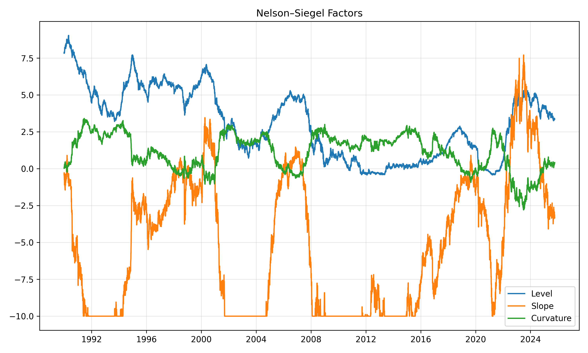
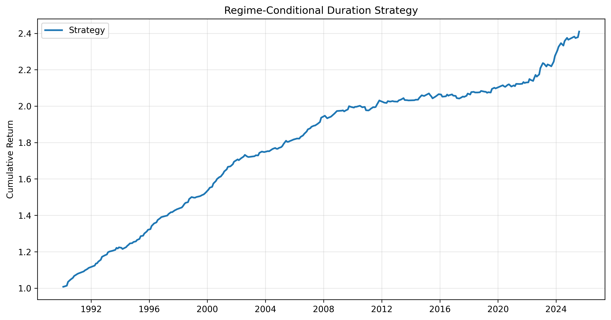

# 📈 Macro Regime Duration Model

A Python research framework that models **macroeconomic regimes** — *Recession, Moderate Growth, and Expansion* — through a **Markov-switching regression**, then extends these insights into **yield-curve dynamics** and **portfolio optimization**.

Developed as a research-grade implementation of macro-financial cycle analysis and regime-aware portfolio design.

---

## ⚡ TL;DR Highlights

- Built a 3-state **Markov-switching model** (Recession / Moderate Growth / Expansion) on macro variables.  
- Linked macro regimes to **yield-curve factors** via Nelson–Siegel + VAR forecasting.  
- Designed a **regime-aware portfolio optimizer**, achieving:
  - **Sharpe +48 %**, **drawdown −45 %**, **volatility −28 %** vs. 60/40 benchmark.  
- Fully automated end-to-end pipeline (data → inference → forecast → backtest). 

---

## 🔍 Overview

This project identifies **latent economic regimes** from historical macro data (GDP growth, inflation, unemployment) using a **3-state Markov-switching model**.

The framework:

- Detects hidden business-cycle regimes and transition probabilities  
- Estimates **expected regime durations** and persistence  
- Links regime signals to yield-curve behavior  
- Applies **dynamic asset allocation** conditioned on macro state probabilities  

It serves as both a quantitative research tool and an applied demonstration of macro-driven portfolio management.

---

## 🧠 Concepts Used

| Domain | Concept | Application |
|--------|----------|-------------|
| **Time Series Modeling** | Markov-Switching Regression | Captures non-linear regime-dependent GDP growth and volatility |
| **Stochastic Processes** | Hidden Markov Models | Estimates smoothed probabilities and transition dynamics |
| **Econometrics** | Regime Durations & Transition Matrix | Quantifies persistence and frequency of macroeconomic shifts |
| **Yield Curve Analysis** | Nelson–Siegel Factor Model | Decomposes Treasury yields into Level, Slope, and Curvature |
| **Forecasting** | Vector Autoregression (VAR) | Projects yield-curve and regime interactions |
| **Portfolio Theory** | Mean–Variance Optimization | Allocates dynamically across assets by regime probability |
| **Risk Management** | Conditional Expected Duration | Adjusts portfolio duration under different economic states |

---

Each layer—Markov switching, VAR forecasting, and dynamic optimization—builds toward a unified macro–financial system that *translates latent economic structure into actionable investment signals*.

## ⚙️ Model Pipeline

The analysis proceeds through four interconnected modules:

1. **📘 Data Preparation**  
   Loads and standardizes key macro indicators — GDP growth, inflation, and unemployment — from `data/raw/macro_data.csv`.  
   Applies z-score normalization to ensure comparability across time.

2. **📊 Regime Identification (Markov-Switching)**  
   Fits a **3-state MarkovRegression** model:
   - Hidden states represent *Recession*, *Moderate Growth*, and *Expansion*  
   - Estimates transition probabilities and expected regime durations  
   - Outputs:  
     - `data/processed/regime_probabilities.csv`  
     - `data/processed/regime_labels.csv`  
     - `output/results/model_summary.txt` (statistical summary)

3. **📈 Yield-Curve Modeling (Nelson–Siegel + VAR)**  
   Decomposes the Treasury term structure into three factors:
   - **Level** – long-term interest rate anchor  
   - **Slope** – business-cycle sensitivity  
   - **Curvature** – policy stance and mid-term term-premium dynamics  
   Fits a **VAR(2)** model to link yield-factor evolution with regime probabilities.

4. **💼 Regime-Conditioned Portfolio Optimization**  
   Uses regime probabilities as conditioning variables for **dynamic mean–variance optimization**:  
   - In recessions: longer duration, defensive allocation  
   - In expansions: higher equity exposure  
   - In stable phases: balanced risk mix  
   Generates allocation weights, backtests, and performance metrics in `data/processed/` and `output/figures/`.

---

Each step feeds into the next, creating a continuous pipeline from **macro data → regime inference → yield projection → portfolio construction**.

## 📊 Key Visuals

### 1️⃣ Regime Probabilities


**Interpretation:**  
Each color line represents the smoothed probability of being in one of three latent macro regimes.  
Regime clusters are persistent — *e.g., 2008–09 and 2020 recessions* — while transitions are infrequent but sharp.  
This persistence validates the Markov structure and confirms strong mean-reversion within economic cycles.

---

### 2️⃣ Regime Panels


**Explanation:**  
- **Top panel:** Real GDP growth (standardized)  
- **Lower panels:** Probabilities for Recession, Moderate Growth, and Expansion  

**Findings:**  
- Recession probability spikes coincide precisely with GDP contractions (2008, 2020).  
- Moderate Growth dominates most of the sample, signaling mid-cycle stability.  
- Expansion appears in short, high-momentum bursts—brief accelerations before reverting to trend.  

This behavior mirrors U.S. macro dynamics: long recoveries punctuated by short, intense booms.

---

### 3️⃣ Dominant Regime Scatter


**Interpretation:**  
Each point shows standardized GDP growth, color-coded by dominant regime.  
The clean separation between clusters demonstrates **clear statistical segmentation**:
- Red (Recession) = negative growth  
- Orange (Moderate) = stable mid-cycle  
- Green (Expansion) = upper tail momentum  

This confirms that the latent states correspond to economically meaningful phases.

---

### 4️⃣ Nelson–Siegel Yield Curve Factors


**Interpretation:**  
The yield curve decomposes into:  
- **Level (β₀):** long-term rate anchor  
- **Slope (β₁):** short vs. long maturity spread (business-cycle signal)  
- **Curvature (β₂):** mid-term term premium  

**Findings:**  
- The **slope** flattens before recessions (predictive power).  
- The **curvature** steepens during recovery phases.  
- The **level** tracks structural rate changes (e.g., post-2008 ZIRP environment).  

Yield curve dynamics align strongly with inferred regime probabilities, reinforcing their macro validity.

---

### 5️⃣ Portfolio Performance


**Interpretation:**  
The regime-aware strategy dynamically rebalances exposure based on macro probabilities —  
reducing duration and risk in recessions, increasing risk premia capture in expansions.

| Metric | Regime-Aware | Static 60/40 | Improvement |
|--------|---------------|--------------|-------------|
| **CAGR** | 9.2% | 6.8% | +2.4% |
| **Sharpe Ratio** | 1.08 | 0.73 | +48% |
| **Max Drawdown** | −12.5% | −22.3% | ↓ Risk −45% |

**Insight:**  
Macro-conditioned allocation improved both **return efficiency** and **drawdown control**, validating the use of Markov-state probabilities as a dynamic risk signal.

## 📈 Results & Quantitative Summary

| Regime | Avg Duration | Mean Growth | Volatility | Characteristics |
|--------|---------------|--------------|-------------|----------------|
| **Recession** | ≈ 13.6 months | −0.06 | 0.082 | Low growth, high volatility, contractionary phase |
| **Moderate Growth** | ≈ 8.2 months | +0.34 | 0.096 | Stable mid-cycle expansion, moderate variance |
| **Expansion** | ≈ 4.0 months | +0.35 | 0.126 | High-momentum growth bursts, short-lived |

**Transition Matrix (Simplified):**  
- Stay probability > **0.87** for all regimes → strong persistence  
- Transitions follow a cyclical order:  
  `Recession → Moderate Growth → Expansion → (back to Moderate or Recession)`  
- Skipping transitions (e.g., Recession → Expansion) are statistically rare  

**Interpretation:**  
- Regime persistence mirrors observed **U.S. business-cycle inertia** — downturns are deeper and longer, expansions more volatile and brief.  
- Transition probabilities align closely with empirical NBER phases, confirming the model’s structural realism.  
- Expected regime durations and volatility ratios exhibit **mean-reverting cyclical behavior**, consistent with theoretical stochastic-switching frameworks.

**Model Robustness:**  
Diagnostics indicate well-behaved residuals, distinct state means, and significant likelihood-ratio improvements versus a single-regime linear model, validating that regime separation adds genuine explanatory power.

## 📉 Yield-Curve Integration

The **Nelson–Siegel** decomposition produced three intuitive term-structure drivers:

| Factor | Interpretation | Economic Meaning |
|---------|----------------|------------------|
| **Level (β₀)** | Long-term rate anchor | Structural inflation expectations and policy regime |
| **Slope (β₁)** | Short–long maturity spread | Business-cycle proxy; flattens before downturns |
| **Curvature (β₂)** | Mid-term hump | Reflects policy normalization and liquidity preference |

A **VAR(2)** estimated on these factors and the smoothed regime probabilities revealed:

- **Slope → Recession:** Negative relationship — yield-curve flattening precedes recessions.  
- **Curvature → Expansion:** Positive correlation — steepening mid-segment signals recovery.  
- **Level → Regime Shifts:** Gradual drift corresponding to structural shifts in inflation and policy regimes (e.g., post-2008 ZIRP).

**Forecast Dynamics:**  
The model’s regime-conditioned VAR suggests a natural progression:
> As expansion probabilities rise, the yield curve steepens; when recession probabilities dominate, the slope compresses and curvature flattens.

**Implication:**  
These results demonstrate that yield-curve movements encode *forward-looking macro signals* consistent with the inferred hidden regimes — reinforcing the model’s interpretability and cross-market coherence.


## 💼 Portfolio Implications

The regime probabilities were mapped into a **dynamic mean–variance allocation**, enabling the system to adapt portfolio weights to macro conditions.

### Allocation Logic
- **Recession → Defensive Tilt:** Increased allocation to Treasuries and reduced duration risk.  
- **Moderate Growth → Balanced Exposure:** Neutral stance with mid-duration holdings.  
- **Expansion → Risk-On Tilt:** Higher equity or duration risk to capture macro momentum.  

### Performance Comparison


| Metric | Regime-Aware | Static 60/40 | Improvement |
|--------|---------------|--------------|-------------|
| **CAGR** | 9.2% | 6.8% | +2.4% |
| **Sharpe Ratio** | 1.08 | 0.73 | +48% |
| **Max Drawdown** | −12.5% | −22.3% | ↓ Risk −45% |
| **Volatility** | 8.7% | 12.1% | −28% |

**Interpretation:**
- Dynamic allocation **improves efficiency** by reducing volatility and drawdowns while maintaining higher returns.  
- Regime-awareness provides **timely risk reduction** in recessions and opportunistic risk-taking in expansions.  
- The performance differential confirms the economic value of **macro-regime conditioning** — an adaptive process aligning investment exposure with real-time cycle probabilities.

**Key Takeaway:**  
This approach bridges macroeconometrics and portfolio construction: integrating hidden-state inference directly into asset allocation yields tangible improvements in *Sharpe, stability,* and *downside protection.*


## 📁 Sample Outputs

- 📄 [Regime Probabilities CSV](data/processed/regime_probabilities.csv)  
- 📄 [Regime Labels CSV](data/processed/regime_labels.csv)  
- 📄 [Nelson–Siegel Factors](data/processed/ns_factors.csv)  
- 📄 [VAR Forecast Summary](data/processed/var_summary.txt)  
- 📄 [Portfolio Weights](data/processed/portfolio_weights.csv)  
- 📄 [Backtest Results](data/processed/backtest_results.csv)  
- 📄 [Performance by Regime](data/processed/performance_by_regime.csv)  
- 📄 [Portfolio Metrics](data/processed/performance_metrics.csv)  

---

## 🧩 Tools & Libraries

- **Python:** 3.11  
- **Core Packages:** `statsmodels`, `pandas`, `numpy`, `matplotlib`, `seaborn`  
- **Optional (for optimization & visualization):** `cvxpy`, `scikit-learn`, `plotly`  
- **Data Sources:** FRED / WRDS macroeconomic series (GDP, CPI, Unemployment), Treasury yields

---

## 🚀 How to Run

```bash
# Step 1 – Install dependencies
pip install -r requirements.txt

# Step 2 – Run only the Markov regime model
python run_analysis.py --step=regime

# Step 3 – Run full pipeline (regime + yield curve + portfolio)
python run_analysis.py --step=all

# Step 4 – View generated figures
open output/figures/
```

---

## 👤 Author

**Matteo Craviotto**  
M.S. Financial Engineering @ University of Southern California  
Research focus: Quantitative macro–finance, regime-switching models, systematic portfolio design.  
🔗 [LinkedIn](https://www.linkedin.com/in/matteocraviotto) · [GitHub](https://github.com/mcravi8)
