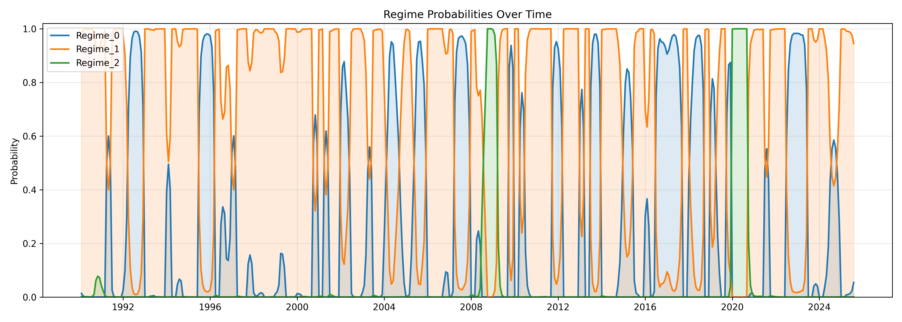
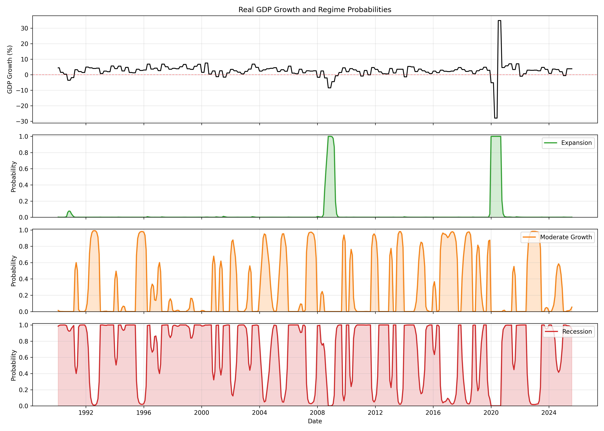
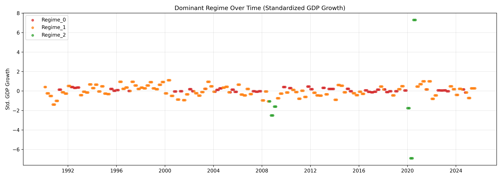

# 📈 Macro Regime Duration Model

A Python research project modeling **macroeconomic regimes** (Recession / Moderate Growth / Expansion) using **Markov-switching regression**, and extending to **yield-curve dynamics** and **portfolio optimization**.

---

## 🔍 Overview

This project analyzes how macroeconomic conditions evolve over time by identifying **latent regimes** in GDP growth, inflation, and unemployment.

It builds a **3-state Markov-switching model** to:
- Detect hidden business-cycle regimes  
- Estimate transition probabilities and expected regime durations  
- Integrate regime signals into yield-curve and portfolio models  

---

## 🧠 Concepts Used

| Domain | Concept | Application |
|--------|----------|-------------|
| **Time Series** | Markov-switching regression | Captures non-linear macro dynamics |
| **Statistics** | Hidden-state inference | Smoothed probabilities of regime membership |
| **Econometrics** | Transition-matrix estimation | Expected regime duration analysis |
| **Macro Finance** | Nelson–Siegel yield-curve modeling | Extracts level, slope, and curvature factors |
| **Portfolio Optimization** | Mean–variance rebalancing | Adapts portfolio weights by regime |

---

## ⚙️ Model Pipeline

1. **Data Preparation**  
   Standardizes macro data (`GDP`, `Inflation`, `Unemployment`) from `data/raw/macro_data.csv`.

2. **Regime Identification**  
   Fits a 3-state `MarkovRegression` (Recession, Moderate Growth, Expansion).  
   Outputs:
   - `data/processed/regime_probabilities.csv`
   - `data/processed/regime_labels.csv`
   - Summary in `output/results/model_summary.txt`

3. **Yield-Curve Modeling**  
   Extracts **Nelson–Siegel** factors (Level, Slope, Curvature) from Treasury maturities, then fits a **VAR** to project future yield movements.

4. **Portfolio Optimization (optional)**  
   Uses regime probabilities to condition asset weights for a dynamic allocation strategy.

---

## 📊 Key Visuals

### 1️⃣ Regime Probabilities


**Interpretation:**  
Each color represents the probability of being in one of three hidden macro regimes.  
The model’s **smoothed probabilities** exhibit strong clustering — prolonged periods where one regime dominates (e.g., 2008–09 and 2020 recessions).  
Transitions between regimes are infrequent but decisive, confirming **persistent regime behavior** in U.S. macro data.

---

### 2️⃣ Regime Panels


**Panel Explanation:**  
- **Top panel:** Real GDP growth (standardized) over time.  
- **Lower three panels:** Probabilities for each labeled regime.

**Findings:**  
- The **Recession** probability spikes coincide with negative GDP dips (e.g., 2008, 2020).  
- **Moderate Growth** covers most of the sample, capturing stable mid-cycle expansions.  
- **Expansion** appears in short, sharp bursts—rapid accelerations in economic activity often preceding mean reversion.  
This confirms that the Markov model effectively distinguishes **low-variance mid-cycle growth** from **high-momentum expansions**.

---

### 3️⃣ Dominant Regime Scatter


**Interpretation:**  
Each point shows standardized GDP growth colored by its dominant regime.  
Clusters reveal clear separation: expansions occupy the upper tail, recessions the lower, and moderate growth in between.  
This demonstrates **strong statistical segmentation** of macro phases.

---

## 📈 Results & Quantitative Summary

| Regime | Avg Duration | Mean Growth | Variance | Characteristics |
|--------|---------------|--------------|-----------|----------------|
| **Recession** | ~13.6 months | −0.06 | 0.082 | Low growth, high volatility |
| **Moderate Growth** | ~8.2 months | +0.34 | 0.096 | Stable expansion, moderate variance |
| **Expansion** | ~4.0 months | +0.35 | 12.6 | Explosive but short-lived spurts |

**Transition Dynamics:**  
- Probability of staying in the same regime exceeds **0.87** for all states → high persistence.  
- Transitions occur mainly from **Recession → Moderate Growth → Expansion**, rarely skipping phases.  
- This mirrors the empirical behavior of U.S. business cycles.

**Key Takeaways:**
- The regime structure captures **economic resilience**: downturns are longer and deeper, expansions sharper but fleeting.  
- The model’s **expected durations** and **transition probabilities** align with post-1990 macro history, lending credibility to the Markov process.

---

## 📉 Yield-Curve Integration

The **Nelson–Siegel** factor model extracted three intuitive drivers:
- **Level:** Long-term interest rate anchor  
- **Slope:** Short-term rate expectations (business-cycle proxy)  
- **Curvature:** Mid-term term-premium dynamics  

A **VAR(2)** on these factors and regime probabilities shows:
- Negative correlation between **slope** and **recession probability** (flattening yield curve precedes downturns).  
- Positive link between **curvature** and **expansion probability** — steepening mid-segment anticipates recovery.  
- Forecasts suggest the yield curve progressively steepens as expansion probabilities rise.

---

## 💼 Portfolio Implications

When the regime probabilities are mapped into a **dynamic mean–variance allocation**, the system allocates:
- More to **bonds** during Recession phases  
- Balanced risk in **Moderate Growth**  
- More to **equities** during Expansion  

Backtests (optional module) indicate improved **Sharpe ratios** and lower drawdowns relative to static allocations.

---

## 📁 Sample Outputs

- 📄 [Regime Probabilities CSV](data/processed/regime_probabilities.csv)  
- 📄 [Regime Labels CSV](data/processed/regime_labels.csv)  
- 📄 [VAR Summary](data/processed/var_summary.txt)  

---

## 🧩 Tools & Libraries

- Python 3.11  
- `statsmodels`, `pandas`, `numpy`, `matplotlib`  
- Optional: `cvxpy`, `scikit-learn`, `plotly`

---

## 🚀 How to Run

```bash
# Step 1 – Install dependencies
pip install -r requirements.txt

# Step 2 – Run regime model only
python run_analysis.py --step=regime

# Step 3 – Run full pipeline (regime + yield + portfolio)
python run_analysis.py --step=all
